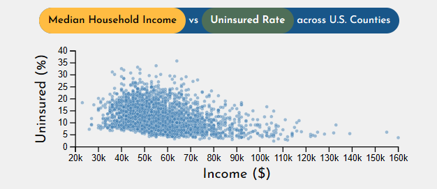
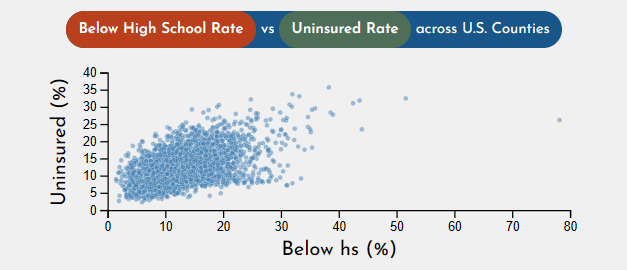
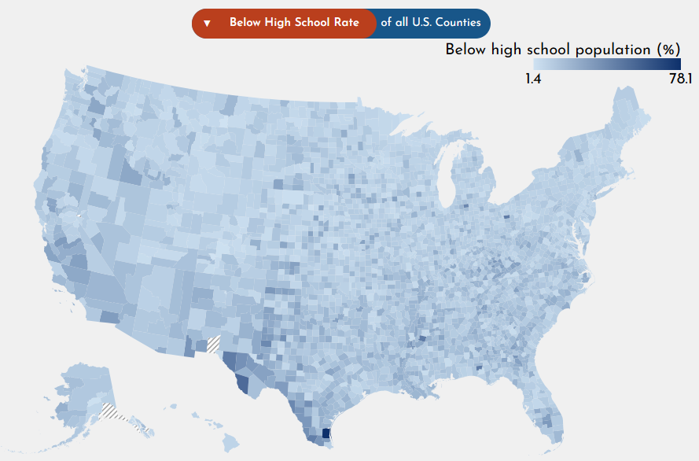
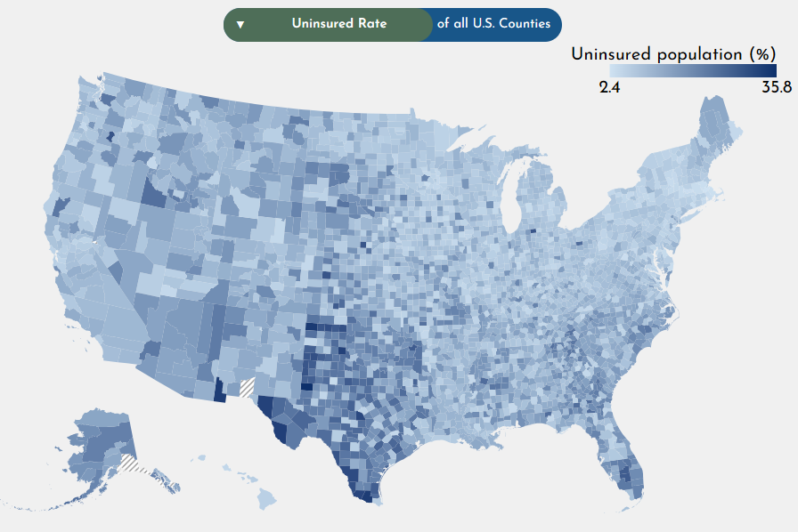

## ✅ Overview
> ### Explain the motivation for your application.  What can it allow someone to understand?
---
This project aim is to help dissect the relation between the rate of health insurance acquisition and three other socioeconomic attributes in the United States.

The main attribute is:
- Percentage of uninsured people (%). aka no health insurance

The other attributes to compare are:
- Median Household Income ($) 
- Poverty percentage (%)
- Percentage of people who have not complete high school (%).

These attributes are specific to each US county in the dataset. In addition, the other attributes can also be compared with each other.

## ✅ About the data

> ### Describe the data and include a link. 
---

The U.S. counties map used is download from [this link](https://cdn.jsdelivr.net/npm/us-atlas@3/counties-10m.json).

The data source of this project is adopted from the Atlas of [Heart Disease and Stroke](https://www.cdc.gov/heart-disease-stroke-atlas/about/?CDC_AAref_Val=https://www.cdc.gov/dhdsp/maps/atlas/index.htm) from the [U.S. Centers for Disease Control and Prevention](https://www.cdc.gov/). This data is then extracted, using only 7 columns:

1. FIPS
2. State
3. County
4. education_less_than_high_school_percent
5. percent_no_heath_insurance
6. median_household_income
7. poverty_perc

## ✅ View Interaction

> ### Explain each view of the data, the GUI, etc. Explain how you can interact with your application, and how the views update in response to these interactions. 
---

There are five visualizations in this application:
1. Histogram A
2. Histogram B
3. Scatter Plot AxB
4. Choropleth Map A
5. Choropleth Map B

These views work together to allow users to compare and understand any pair A and B out of these 4 data attributes of the dataset:
1. Percent of population with education less than high school
2. Percent of population with no health insurance
3. Poverty percentage
4. Median household income

Below are the three main ways that you can interact with the visualizations

> #### 1. Hover
   - Histogram: Hover over a bar to see the number of counties withing that distribution.
   - Scatter plot: Hover over a county to see its name and X, Y attributes.
   - Map: Hover over a county to see its name and value.
> #### 2. Changing data
   - Right above the map there is a dropdown. You can click on it and select among the four attributes to observe one in more detail.
   - The dropdown on the left controls
     - The X-axis of histogram A
     - The X-axis of the scatter plot
     - The entirey of map A
   - The dropdown on the right controls
     - The X-axis of histogram B
     - The Y-axis of the scatter plot
     - The entirety of map B  
> #### 3. Brushing
   - Brushing allow users to filter the data source of both attributes being compared. This change will then reflect on the map, showing only the filtered states.
   - You can start brushing on the scatterplot and the two histograms. They are linked together as follows
    - Brushing histogram A updates the brush width of the scatter plot.
    - Brushing histogram B updates the brush height of the scatter plot.
    - Brushing the scatter plot updates the width of both histograms.
  - Start brushing 
    - Drag from anywhere and drop to anywhere on the visualization.
    - Move the existing brush overlay to anywhere on the visualization.
    - Resize the width of the brush of the histograms, and both the height and width of the scatter plot.
  - Stop brushing
    - Click outside of the brushed area to cancel brushing and reset to the normal view.

## ✅ Findings and Conclusion
> ### What your application enables you to discover: Present some findings you arrive at with your application. 
---

***Insight 1***: Comparing "Median Household Income" and "Uninsured Rate" using the scatter plot shows that as income grows the rate of uninsured reduces significantly. This reinforces the idea that as people get richer, they are more likely to acquire health insurance.

***Insight 2***: Comparing "Below High School Rate" and "Uninsured Rate" using the scatter plot shows that in counties where there are fewer people finish high school, seemingly leading to a lower education, perhaps making them less aware of health insurance's benefits. As a result, this increase the percentage of uninsured people.

***Insight 3***: From the map of "Uninsured Rate" and "Below High School Rate", we can observe that the areas with the highest lower-than-high-school rate coincides with the areas where the uninsured rate are the highest. This insight reinforce insight 2 and make us question the Southern Coast of America.

## ✅ Creation Process
> ### Process: what libraries did you use? How did you structure your code?  How can you access it and run it? Link to your code (and the live application, if it is deployed online). 
---

> #### 1. Data Pre-processing

I upload the files to [Observable HQ](https://observablehq.com/@js7006/usa-data-visualization-project) to handle the data
- I parse the attributes "State" and "County" from the "Location" attribute
- I made a simple scatter plot to see which features I should pick.
- I filtered the picked feature using code.
- I downloaded the CSV for the filtered data.

> #### 2. Libraries

I use D3.js as the main library for visualization

> #### 3. Code Structure

1. HTML: `index.html`
   - This file contains the layout and templates for visualizations and their titles. It import script files and style sheets.

2. CSS: `style.css`
   - Apply styling to the application.

3. JS:
   1. `script.js`: 
        - Render the dropdowns dynamically 
        - Load the data and initialize the class instance in `visualization.js`
   2. `visualization.js`
        - Class definition for Visualization - Initialize all five visualizations
        - Handle the interactiosn between them: Map update, brush sync
   3. `histogram.js`: Class definition for Histogram
   4. `scatter.js`: Class definition for Scatter Plot
   5. `choroplethMap.js`: Class definition for Map
   6. `const.js`: Contains label, tooltip text, color, background, title, and axis text for all attributes.

> #### 4. Run

***Download***: To fork or download this code. Navigate to the [GitHub Repo](https://github.com/nam-k-nguyen/health-insurance-data-visualization)

***Local***: To run the code locally, simply open the index.html file in your browser of choice.

***Live Site***: Open the live version of the website here: [Data Visualization App](https://health-insurance-data-visualization.vercel.app/)

## ✅ Challenges and reflection

> ### Challenges and future work: perhaps you struggled with the project and learned a lot, but maybe there wasn't quite time to create the project you hoped to have.  It may feel like you don't have as much to write in your documentation, so you can include
---

> #### 1. Future works 

The future plan for this project consists of the following
- Add a brushing functionality for the map to incorporate geographical filtering.
- Adding more features to the app.
- Optimize code so that it renders even faster.
- Add filtering by states.
- Refine the UI: change datum color on hover

> #### 2. Challenges: (mainly brush syncing)

1. I needed to link the brushing of the histogram and the scatterplot such that the histogram updates when the scatterplot updates and vice versa. The two plots kept reactively update each other infinitely. Fixing this took me three whole different implementations. I ended up using a flag attribute to signal whether the brush event is triggered organically (from user interaction), or programmatically (from the code trying to sync brushes). If programmatically triggered, the event handler will not try to sync brushes again. If organically triggered, it will try to sync brushes.
2. Also from the syncing brushes part. It was very time consuming to figure out the selection object in D3. In particular, I had to figure out
   - How to parse the selection object from the scatter plot and use that selection to programmatically brushes the histograms.
   - How to parse the selection object from the histograms and use that selection to programmatically brushes the scatter plot.
3. How might I approach future projects
   - I will figure out the logic first, on paper, digital drawings, or some type of brainstorming tools. This will help me look at my program more holistically and the development process smoother.
   - I will spend more time examining the data to unveil more interesting patterns. I think my them is enough, but not exceptionally insightful.
   - I will start it sooner 😭.

## ✅ External assistance
> ### Use of AI and collaboration with other students-Did you use AI? I want to learn form you how you used it. Note any peers who were helpful in debugging or learning as you worked on your project.
--- 

I did not consult another peer during the development of this project.

I used AI to
- Discuss the data, and list potential features to use as my theme, and list potential supplementary features for the theme.
- Help me generate the boilerplate code for the histogram and the scatterplot, which I then develop upon and fix some small issues.
- Debug (a lot).
- Auto-complete my repetive code. GitHub Copilot help me tremendously. As an alternative to typing a similar logic 5 times. I write the code for 1, and press tab 4 times. It does get it wrong ~30% of the time though.